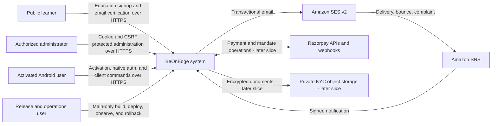
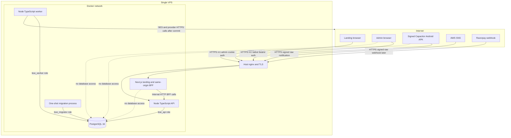

# System, TypeScript, Tooling, and Contract Architecture

**Status:** Phase 0 approved; Phase 2 implementation in progress through the
contracts kernels and the authoritative TypeScript/Fastify liveness runtime

**Applies to:** Phase 2 foundation through the Phase 10 clean baseline

**Companion specifications:** `02-product-architecture-decisions.md`,
`03-schema-lifecycle-specification.md`, and
`04-api-security-test-specification.md`

## 1. Repository Truth and Fixed Boundaries

The design below began from the pre-reset repository snapshot. Items explicitly
marked as current are updated as replacement batches land:

- Before the runtime-reset batch, `backend_controller` was an independent Node
  ESM package with a custom JavaScript router, `pg`, Razorpay, and no TypeScript
  configuration. Its current authoritative entrypoint is strict TypeScript and
  Fastify; unreplaced JavaScript remains unreachable migration inventory.
- `frontend_stack` is an npm workspace for `app` and `packages/*`, explicitly
  excluding `packages/landing_page`. Its app is Vite/React and owns the
  Capacitor/Android shell.
- `frontend_stack/packages/landing_page` is an independent Next.js 14.2 package
  with its own lockfile and strict TypeScript configuration, although
  `allowJs` is currently enabled.
- Current reusable frontend code in `frontend_stack/packages/shared` is a UI and
  display package, not an HTTP contract package. It must not become a mix of UI,
  provider DTOs, database types, and API schemas.
- The backend, frontend workspace, landing, and root each currently have a
  separate npm lockfile. Phase 2 preserves these install boundaries.
- The release manager currently builds backend and landing from package-specific
  Docker contexts. Both builds move to the repository-root context, with
  explicit Dockerfile paths, when the common contract package is introduced.
- The canonical planning set is tracked below `resources/sessions/1/` in the
  primary checkout. After its commit is
  merged/rebased, the existing `resources` sparse patterns materialize it
  read-only in each surface worktree. The sparse worktrees include no root
  `packages` path yet, so that path must be extended explicitly when contracts
  are introduced.
- Root `.gitignore` currently makes all of `release_manager/**` local even
  though Phase 2 must change `export.sh` and the deploy template. Before those
  changes, add a narrow tracked-source allowlist for release scripts,
  `lib/*.sh`, public documentation/examples, and
  `BOE_APP/docker-compose.yml`. Never broadly unignore local environments,
  images, database dumps, manifests, live state, or rollback artifacts.
- Only `main` integrates shared packages, backend, database, lockfiles, Docker,
  CI, and releases. Surface worktrees implement their owned UI against a shared
  contract already landed on `main`.

### 1.1 Chosen package topology

Create one independent, private package at:

```text
packages/contracts/
├── package.json
├── package-lock.json
├── tsconfig.json
├── vitest.config.ts
├── src/
│   ├── scalars.ts
│   ├── envelope.ts
│   ├── errors.ts
│   ├── operations/
│   │   ├── public.ts
│   │   ├── admin.ts
│   │   ├── activation.ts
│   │   ├── native-auth.ts
│   │   ├── web-auth.ts
│   │   └── provider.ts
│   ├── client/
│   │   ├── transport.ts
│   │   └── create-api-client.ts
│   └── index.ts
├── scripts/
│   └── generate-openapi.ts
└── generated/
    ├── openapi-v1.json
    └── openapi-v1.d.ts
```

The package name is `@beonedge/contracts`, version `0.1.0`, with
`private: true`, `type: module`, `sideEffects: false`, and explicit subpath
exports. It exports only boundary schemas, inferred wire types, operation
descriptors, the typed `openapi-fetch` client factory, generated OpenAPI path
types, and the OpenAPI document. It never exports
database rows, Kysely types, domain entities, provider SDK objects, React code,
storage, cookies, or environment configuration.

`src/operations` is the only authored HTTP contract. Each operation descriptor
contains operation ID, method, path template, auth channel, request schemas,
success schema, documented error codes, and idempotency requirement. TypeScript
wire types use `z.infer`; no duplicate handwritten interface is allowed.

There is one contract pipeline. `scripts/generate-openapi.ts` imports the Zod
operation descriptors and uses `@asteasolutions/zod-to-openapi` to
deterministically emit the committed OpenAPI 3.1 document. The pinned
`openapi-typescript` CLI consumes that committed document and emits the
committed `generated/openapi-v1.d.ts`. The authored
`src/client/create-api-client.ts` supplies those generated `paths` types to
`openapi-fetch`; surface-specific wrappers inject transport and select the
allowed operation group. There is no operation-map generator, custom client
source generator, second schema DSL, or handwritten duplicate wire interface.
`dist/**` is generated by `tsc` and ignored. CI runs both generation steps and
fails if `git diff --exit-code -- packages/contracts/generated` is nonzero.
Generated files are never edited manually.

The contract manifest exposes one ordered command:

```text
generate:openapi = tsx scripts/generate-openapi.ts
generate:types = openapi-typescript generated/openapi-v1.json -o generated/openapi-v1.d.ts
generate = npm run generate:openapi && npm run generate:types
```

`generate:types` never reads Zod directly, and the client factory never reads
operation descriptors directly; the committed OpenAPI document is the only
handoff between schema generation and client typing.

The package has its own lockfile rather than expanding the root into a new
workspace. Consumers declare local file dependencies:

| Consumer manifest | Dependency value |
|---|---|
| `backend_controller/package.json` | `"@beonedge/contracts": "file:../packages/contracts"` |
| `frontend_stack/packages/admin/package.json` | `"@beonedge/contracts": "file:../../../packages/contracts"` |
| `frontend_stack/packages/client/package.json` | `"@beonedge/contracts": "file:../../../packages/contracts"` |
| `frontend_stack/packages/landing_page/package.json` | `"@beonedge/contracts": "file:../../../packages/contracts"` |

The Vite app receives the package transitively from admin/client; it may add a
direct dependency only if app-shell code itself imports a contract. The package
has no `prepare` hook. CI and Docker explicitly install/build it before consumer
`npm ci`, guaranteeing `dist` exists before the local package is packed. Every
consumer install uses `npm ci --install-links=true` (and lockfiles are generated
with that setting), so the local `file:` dependency is packed/copied into
consumer `node_modules` instead of becoming an external symlink.
All four consuming lockfiles are updated once on `main` and CI rejects an
unresolved, registry-sourced, or symlinked-outside-runtime
`@beonedge/contracts` entry.

### 1.2 Docker and release build boundary

The contract package changes both consumer builds from package-local contexts
to the repository root. The command shapes are:

```text
docker build -f backend_controller/Dockerfile -t <backend-image> .
docker build -f frontend_stack/packages/landing_page/Dockerfile \
  --build-arg BEO_API_BASE=<internal-backend-url> -t <landing-image> .
```

Docker stages preserve repository-relative local-package paths: contracts build
under `/app/packages/contracts`, backend installs under
`/app/backend_controller`, and landing installs under
`/app/frontend_stack/packages/landing_page`. Contracts are installed and built
before either consumer runs `npm ci`/build. A root `.dockerignore` is an
allowlist for the contract, backend, landing, and required release/version
inputs; package-local `.dockerignore` files do not protect a root build context.
The backend final stage copies the consumer's production `node_modules`, which
contains the packed contract and its runtime dependencies, plus backend `dist`.
It does not depend on `/app/packages/contracts` remaining in the final image.
The exact-image smoke removes builder/source paths, rejects an external symlink,
imports `@beonedge/contracts`, and then starts the emitted backend.

Landing expands Next 14's `experimental.outputFileTracingRoot` from the landing
directory to the repository root when it imports the local contract package,
so standalone output traces the external dependency. `release_manager/export.sh`
uses the root context with the explicit Dockerfile paths above. The deploy
Compose file remains image-only. Release Dockerfiles pin every base image by
OCI digest (retaining a readable tag in a comment). Release metadata records
the exact commit, human-readable image tags, local image ID/config digest,
Dockerfile paths, contract build provenance, and SHA-256 for every archive and
manifest rather than adding a source build context to the VPS Compose template.
It records `RepoDigest` only after an actual registry push/pull; an OCI-layout
archive records its manifest digest instead. CI recomputes and verifies the
applicable values during isolated archive/import rehearsal and before any
release transfer.

The phase that introduces contracts must build both images, start them, and
pass backend health plus landing/BFF smoke from those exact images. Later
migration, worker, provider, E2E, and rollback behavior gates remain in their
owning phases, but no shared-contract phase passes its internal build gate
without this basic image proof. Production release remains subject to the
Phase 4/5 security boundary.

### 1.3 Sparse-worktree visibility

Add root `packages/contracts` to all three sparse worktrees:

| Worktree | Existing surface owner | Added shared visibility | Write rule |
|---|---|---|---|
| `wt/landing` | `frontend_stack/packages/landing_page` | `packages/contracts` | Read/consume only; contract changes land on `main` |
| `wt/admin` | `frontend_stack/packages/admin` | `packages/contracts` | Read/consume only; contract changes land on `main` |
| `wt/client` | `frontend_stack/packages/client`, `frontend_stack/app` | `packages/contracts` | Read/consume only; contract changes land on `main` |

`packages/contracts` is always main-owned. A surface needing a contract change
first lands the schema/generation change and all lockfiles on `main`, then
rebases/merges that commit into its worktree. A surface must not add a local
schema with the same operation ID or copy generated files into its source tree.

## 2. System Diagrams

### 2.1 System context



The public system calls the experience **Join BeOnEdge**. The internal
application, review, KYC, risk, and derived eligibility model is not exposed in
public copy or public identifiers.

### 2.2 Runtime containers and trust boundaries



Nginx exposes landing and approved API routes only. PostgreSQL, migration, worker
health, and metrics ports remain loopback/Docker-internal. API and worker use the
same image but different commands, database roles, health probes, and replica
controls.

### 2.3 Backend component architecture

```mermaid
flowchart LR
    transport[Fastify TypeScript transport]
    boundary[Zod request, response, environment, provider boundaries]
    authn[Web and native authentication]
    authz[Permission and ownership authorization]
    commands[Application command services and transaction boundaries]
    queries[Application query services]
    domain[Immutable domain state and transition guards]
    repos[Domain Kysely repositories]
    db[(PostgreSQL)]
    outbox[Outbox and provider inbox]
    workers[Email, provider, and scheduled workers]
    adapters[SES, SNS, Razorpay, crypto, clock adapters]
    audit[Audit and idempotency]
    contracts[@beonedge/contracts]

    contracts --> transport
    transport --> boundary
    boundary --> authn
    authn --> authz
    authz --> commands
    authz --> queries
    commands --> domain
    commands --> repos
    commands --> audit
    queries --> repos
    repos --> db
    audit --> db
    commands --> outbox
    outbox --> db
    workers --> outbox
    workers --> commands
    workers --> adapters
    adapters --> boundary

    transport -. maps only .-> commands
    repos -. no provider calls .-> adapters
```

Dependency direction is inward. Transport maps wire values to commands and
domain results back through response schemas. Repositories receive an explicit
Kysely transaction, contain SQL/row mapping only, and return new immutable
values. Provider adapters cannot mutate repositories directly.

### 2.4 First-slice ERD

`application_details`, KYC/risk, catalog, investing, and payment tables are not
part of this first-slice ERD.

```mermaid
erDiagram
    APPLICATIONS ||--o{ APPLICATION_CONSENTS : records
    CONSENT_DOCUMENTS ||--o{ APPLICATION_CONSENTS : accepted_version
    APPLICATIONS ||--o{ VERIFICATION_TOKENS : verifies
    USERS ||--o{ VERIFICATION_TOKENS : password_reset
    APPLICATIONS ||--o| APPLICATION_REVIEWS : decided_by
    USERS ||--o{ APPLICATION_REVIEWS : reviewer
    APPLICATIONS ||--o| USERS : creates_after_approval
    USERS ||--o{ ACTIVATION_INVITES : receives
    APPLICATIONS ||--o{ ACTIVATION_INVITES : authorizes
    USERS ||--o| USER_CREDENTIALS : authenticates_with
    USERS ||--o{ AUTH_SESSIONS : owns
    AUTH_SESSIONS ||--o{ AUTH_REFRESH_TOKENS : rotates
    USERS ||--o{ USER_ROLES : assigned
    USERS ||--o{ ROLE_PERMISSIONS : grants_or_revokes
    USERS ||--o{ APPROVAL_ACTIONS : makes_or_checks
    ROLES ||--o{ USER_ROLES : grants
    ROLES ||--o{ ROLE_PERMISSIONS : contains
    PERMISSIONS ||--o{ ROLE_PERMISSIONS : maps
    APPLICATIONS ||--o{ EMAIL_DELIVERIES : subject
    USERS ||--o{ EMAIL_DELIVERIES : subject
    VERIFICATION_TOKENS ||--o{ EMAIL_DELIVERIES : sends
    ACTIVATION_INVITES ||--o{ EMAIL_DELIVERIES : sends
    OUTBOX_EVENTS |o--o| EMAIL_DELIVERIES : dispatches
    EMAIL_DELIVERIES ||--o{ EMAIL_PROVIDER_EVENTS : receives
    EMAIL_PROVIDER_EVENTS ||--o{ EMAIL_SUPPRESSIONS : creates
    APPLICATIONS ||--o{ AUDIT_EVENTS : evidences
    USERS ||--o{ AUDIT_EVENTS : actor_or_subject
    USERS ||--o{ IDEMPOTENCY_RECORDS : scopes_admin
    USERS ||--o{ EMAIL_SUPPRESSIONS : lifts
    USERS ||--o{ LEGAL_HOLDS : places_or_releases

    APPLICATIONS {
        uuid id PK
        text email_normalized
        text phone_e164
        text full_name
        application_state state
        timestamptz email_verified_at
        timestamptz submitted_at
        timestamptz review_started_at
        timestamptz decided_at
        timestamptz withdrawn_at
        timestamptz pii_tombstoned_at
        timestamptz created_at
        timestamptz updated_at
        bigint version
    }
    CONSENT_DOCUMENTS {
        uuid id PK
        text kind
        text version
        text public_path
        text content_markdown
        bytea content_sha256
        timestamptz published_at
        timestamptz retired_at
        timestamptz created_at
    }
    APPLICATION_CONSENTS {
        uuid id PK
        uuid application_id FK
        uuid consent_document_id FK
        timestamptz accepted_at
        bytea ip_hmac
        text ip_hmac_key_version
        text user_agent
        timestamptz created_at
    }
    VERIFICATION_TOKENS {
        uuid id PK
        uuid application_id FK
        uuid user_id FK
        token_purpose purpose
        bytea token_hash
        text token_key_version
        timestamptz expires_at
        timestamptz consumed_at
        timestamptz revoked_at
        timestamptz created_at
    }
    APPLICATION_REVIEWS {
        uuid id PK
        uuid application_id FK
        uuid reviewer_user_id FK
        application_decision decision
        text reason_code
        text reason_detail
        uuid request_id
        text idempotency_key
        timestamptz created_at
    }
    USERS {
        uuid id PK
        uuid application_id FK
        text email_normalized
        text phone_e164
        text full_name
        user_account_state account_state
        timestamptz activated_at
        timestamptz suspended_at
        timestamptz closed_at
        timestamptz pii_tombstoned_at
        timestamptz created_at
        timestamptz updated_at
        bigint version
    }
    USER_CREDENTIALS {
        uuid user_id PK, FK
        text password_hash
        timestamptz password_changed_at
        integer failed_attempt_count
        timestamptz failed_attempt_window_started_at
        timestamptz locked_until
        timestamptz created_at
        timestamptz updated_at
        bigint version
    }
    ACTIVATION_INVITES {
        uuid id PK
        uuid user_id FK
        uuid application_id FK
        bytea token_hash
        text token_key_version
        activation_invite_state state
        timestamptz expires_at
        timestamptz accepted_at
        timestamptz revoked_at
        text revocation_reason
        uuid created_by_user_id FK
        timestamptz created_at
        bigint version
    }
    AUTH_SESSIONS {
        uuid id PK
        uuid user_id FK
        uuid token_family_id
        session_channel channel
        bytea device_id_hash
        auth_session_state state
        bigint generation
        text refresh_key_version
        bytea previous_refresh_token_hash
        text previous_refresh_key_version
        timestamptz previous_refresh_valid_until
        uuid last_rotation_id
        bytea csrf_token_hash
        text csrf_key_version
        bytea previous_csrf_token_hash
        text previous_csrf_key_version
        timestamptz previous_csrf_valid_until
        timestamptz csrf_expires_at
        timestamptz csrf_rotated_at
        inet ip_address
        text user_agent
        timestamptz last_seen_at
        timestamptz expires_at
        timestamptz revoked_at
        text revocation_reason
        timestamptz expired_at
        timestamptz created_at
        timestamptz updated_at
        bigint version
    }
    AUTH_REFRESH_TOKENS {
        uuid id PK
        uuid session_id FK
        uuid user_id FK
        bytea token_hash
        text token_key_version
        bigint generation
        timestamptz expires_at
        timestamptz used_at
        timestamptz revoked_at
        uuid replaced_by_token_id FK
        timestamptz created_at
    }
    ROLES {
        uuid id PK
        text code UK
        text name
        timestamptz created_at
        timestamptz updated_at
        bigint version
    }
    PERMISSIONS {
        uuid id PK
        text code UK
        text description
        timestamptz created_at
    }
    ROLE_PERMISSIONS {
        uuid role_id PK, FK
        uuid permission_id PK, FK
        uuid granted_by_user_id FK
        timestamptz granted_at PK
        uuid revoked_by_user_id FK
        timestamptz revoked_at
    }
    USER_ROLES {
        uuid user_id PK, FK
        uuid role_id PK, FK
        uuid granted_by_user_id FK
        timestamptz granted_at PK
        uuid revoked_by_user_id FK
        timestamptz revoked_at
    }
    APPROVAL_ACTIONS {
        uuid id PK
        text action_type
        text target_type
        uuid target_id
        bigint target_version
        jsonb canonical_payload
        bytea payload_hash
        approval_state state
        uuid maker_user_id FK
        text maker_reason
        uuid checker_user_id FK
        text checker_reason
        timestamptz created_at
        timestamptz approved_at
        timestamptz rejected_at
        timestamptz executed_at
        timestamptz stale_at
        timestamptz expired_at
        timestamptz expires_at
        timestamptz updated_at
        bigint version
    }
    IDEMPOTENCY_RECORDS {
        uuid id PK
        text actor_scope
        text actor_scope_key_version
        text http_method
        text route_template
        text key
        uuid actor_user_id FK
        bytea request_hash
        integer response_status
        jsonb response_body
        timestamptz created_at
        timestamptz completed_at
        timestamptz expires_at
    }
    RATE_LIMIT_WINDOWS {
        text bucket PK
        bytea key_hash PK
        timestamptz window_start PK
        integer count
        timestamptz expires_at
    }
    LEGAL_HOLDS {
        uuid id PK
        text entity_type
        uuid entity_id
        text reason
        uuid placed_by FK
        timestamptz placed_at
        timestamptz expires_at
        uuid released_by FK
        timestamptz released_at
    }
    AUDIT_EVENTS {
        uuid id PK
        timestamptz occurred_at
        actor_type actor_type
        uuid actor_user_id FK
        text command
        text entity_type
        uuid entity_id
        text from_state
        text to_state
        text reason_code
        text reason_detail
        uuid request_id
        text idempotency_key
        bigint entity_version
        inet ip_address
        text user_agent
        jsonb metadata
    }
    OUTBOX_EVENTS {
        uuid id PK
        text topic
        text event_type
        integer event_version
        text aggregate_type
        uuid aggregate_id
        timestamptz occurred_at
        uuid request_id
        uuid causation_id
        uuid correlation_id
        text deduplication_key UK
        jsonb payload
        outbox_state state
        integer attempt_count
        timestamptz available_at
        timestamptz locked_at
        text locked_by
        timestamptz lease_expires_at
        timestamptz delivered_at
        timestamptz cancelled_at
        text last_error_code
        timestamptz created_at
        timestamptz updated_at
    }
    EMAIL_DELIVERIES {
        uuid id PK
        uuid outbox_event_id FK
        uuid application_id FK
        uuid user_id FK
        uuid verification_token_id FK
        uuid activation_invite_id FK
        text template_key
        text template_version
        bytea recipient_ciphertext
        bytea recipient_nonce
        bytea recipient_hmac
        text recipient_masked
        text recipient_encryption_key_version
        text suppression_hmac_key_version
        text ses_configuration_set
        text ses_message_id UK
        text ses_request_id
        email_delivery_state state
        integer attempt_count
        timestamptz last_attempt_at
        text last_error_code
        bytea failure_detail_ciphertext
        bytea failure_detail_nonce
        text failure_detail_key_version
        timestamptz sent_at
        timestamptz delivered_at
        timestamptz bounced_at
        timestamptz complained_at
        timestamptz cancelled_at
        timestamptz erased_at
        timestamptz created_at
        timestamptz updated_at
        bigint version
    }
    EMAIL_PROVIDER_EVENTS {
        uuid id PK
        text sns_message_id UK
        text sns_topic_arn
        text sns_type
        text ses_event_type
        text ses_message_id
        uuid delivery_correlation_id
        uuid email_delivery_id FK
        bytea payload_ciphertext
        bytea payload_nonce
        bytea payload_sha256
        text payload_key_version
        text state
        timestamptz received_at
        timestamptz processed_at
        timestamptz expires_at
        timestamptz erased_at
    }
    EMAIL_SUPPRESSIONS {
        bytea recipient_hmac PK
        text suppression_hmac_key_version PK
        text reason
        uuid source_event_id FK
        timestamptz created_at
        timestamptz lifted_at
        uuid lifted_by_user_id FK
        text lift_reason
    }
```



Entity and attribute names in this ERD are copied from the normative first-slice
tables in `03`; nullable columns are still shown because Mermaid does not encode
PostgreSQL nullability. `IDEMPOTENCY_RECORDS` deliberately has no state or lease:
only a completed response is inserted after the command succeeds. The nullable
`EMAIL_DELIVERIES.outbox_event_id` uses `ON DELETE SET NULL`: it is mandatory
while delivery work is queued/retryable/in flight, then may be cleared when the
terminal outbox row reaches its shorter retention boundary. Composite
token/application and invite/user foreign keys prevent cross-subject delivery.

## 3. Backend TypeScript Architecture

### 3.1 Runtime and compiler baseline

Phase 2 standardizes development, CI, Docker, and VPS on Node
`>=22.19.0 <23`. Kysely 0.29 requires Node 22, Redocly's lower minimum is
already satisfied, and the selected future Testcontainers 12 chain is approved
against the 22.19 floor. Backend and contract package engines, CI setup,
container bases, and the documented operator runtime use the same range so
local and release behavior do not silently diverge.

Use two backend compiler configurations:

- `backend_controller/tsconfig.json`: strict source, test, and guard-tool
  typecheck with `noEmit`.
- `backend_controller/tsconfig.build.json`: emits production API, worker, and
  scripts to `dist` while excluding tests.

The base compiler options are fixed:

```json
{
  "compilerOptions": {
    "target": "ES2022",
    "lib": ["ES2022"],
    "module": "NodeNext",
    "moduleResolution": "NodeNext",
    "strict": true,
    "noUncheckedIndexedAccess": true,
    "exactOptionalPropertyTypes": true,
    "useUnknownInCatchVariables": true,
    "noImplicitOverride": true,
    "allowJs": false,
    "verbatimModuleSyntax": true,
    "resolveJsonModule": true,
    "esModuleInterop": true,
    "forceConsistentCasingInFileNames": true,
    "skipLibCheck": true,
    "sourceMap": true,
    "inlineSources": true,
    "types": ["node"]
  }
}
```

`tsconfig.build.json` extends `tsconfig.json`, sets `rootDir: "src"`,
`outDir: "dist"`, and `noEmit: false`; it includes the TypeScript `src/**/*`
tree and excludes `**/*.test.*` and `dist`. `tsconfig.json` includes source,
tests, source-only guard tooling, and Vitest configuration without a `rootDir`.
Production operational entrypoints such as migrate and
bootstrap seed move under `src/scripts` in the authorized Phase 2 change so
they are emitted into `dist/scripts`; source-only guard tooling may remain under
the root `scripts` directory and is never required by the runtime image. No
production declaration files are needed for the application; the contract
package emits declarations.

`allowJs` is false from the first backend runtime reset. Existing JavaScript is
not copied into `dist` and is not a supported source-mode runtime. Every bounded
replacement deletes its superseded `.js`/`.jsx` production and test files in the
same commit. Untouched legacy files may remain only as unreachable migration
inventory until their real TypeScript replacement lands. Phase 9 proves no
production JS/JSX remains; it does not perform a late compiler-mode switch.
`skipLibCheck` may be reconsidered only after all package majors are pinned;
project source remains fully strict regardless.

### 3.2 ESM imports and aliases

Keep `type: module`. The authoritative TypeScript runtime does not inherit the
legacy `#router`, `#config/*`, `#db/*`, `#http/*`, `#security/*`, `#shared/*`,
`#client/*`, `#admin/*`, or `#website/*` aliases. New and converted modules use
NodeNext-relative `.js` specifiers. Package-name imports are reserved for real
package boundaries such as `@beonedge/contracts`; no source/dist conditional
alias bridge or blanket TypeScript path alias is introduced.

Every new or converted backend TypeScript module uses a NodeNext-relative
specifier with the emitted `.js` suffix—for example,
`import { parseInput } from "./parse-input.js"`. TypeScript and `tsx` resolve
that specifier to the sibling `.ts` source during typecheck/development, while
the emitted import runs directly in Node. A migrated dependency closure must not
import an unchanged legacy alias or production JavaScript. The contract package
is imported by package name; Kysely database types stay under `src/db/types` and
never enter that package.

### 3.3 Package scripts and output

Phase 2 adds typecheck, build, lint, test, and smoke scripts and immediately
replaces `src/server.js` with the authoritative `src/server.ts`. Production runs
only emitted `dist`; source and emitted liveness smoke must pass before the
runtime-reset slice completes.

| Script | Exact purpose/command shape |
|---|---|
| `dev` | `node --import=tsx --watch src/server.ts` |
| `dev:worker` | after worker introduction: `node --import=tsx --watch src/worker.ts` |
| `typecheck` | `tsc -p tsconfig.json` |
| `build` | clean ignored `dist`, then `tsc -p tsconfig.build.json` |
| `start` | `node dist/server.js`; the emitted runtime uses relative NodeNext imports and no legacy aliases |
| `start:worker` | after worker introduction: `node dist/worker.js` |
| `migrate` | `node dist/scripts/migrate.js up` in production; a separate `migrate:dev` uses `tsx` |
| `seed:bootstrap` | `node dist/scripts/seed-bootstrap.js` in production; explicit enable/config required |
| `test:unit` | `vitest run --config vitest.config.ts` for migrated TypeScript |
| `test` | run the TypeScript suites owned by the migrated runtime closure |
| `test:integration` | introduced in Phase 3 with the PostgreSQL/Testcontainers harness, not installed or accepted in Phase 2 |
| `test:coverage` | Vitest V8 coverage for the migrated TypeScript package; enforce at least 80% on all four metrics |
| `smoke:source` | launch `src/server.ts` with `tsx` and assert exact `/health/live` behavior without PostgreSQL |
| `smoke:dist` | build, launch plain `node dist/server.js`, and assert the same liveness behavior |

Only the build script removes ignored `dist`; source, migrations, generated
contracts, and snapshots are never deleted. After `smoke:dist` passes, Docker
copies `dist`, SQL migrations, package metadata, and production dependencies
into the runtime stage and does not copy `src`. `tsx`, TypeScript, Vitest, and
compiler toolchains stay in builder/test stages. Testcontainers is introduced
only in the Phase 3 test environment and never enters a runtime image.

### 3.4 Module layout and invariants

New backend TypeScript is organized by domain:

```text
backend_controller/src/
├── app/                 # composition root and transaction application services
├── domains/
│   ├── onboarding/
│   ├── identity/
│   ├── administration/
│   ├── compliance/
│   ├── catalog/
│   ├── investing/
│   ├── payments/
│   └── platform/
├── db/                  # Kysely instance, database types, migrations adapter
├── http/                # Fastify adapters and envelope mapping
├── providers/           # SES, SNS, Razorpay, crypto and clock adapters
├── security/            # auth/session/password/RBAC policies
├── workers/             # queue claim loops and handler registries
├── scripts/             # emitted migrate/bootstrap operational entrypoints
├── server.ts
└── worker.ts
```

Each domain owns `model.ts`, `commands.ts`, `repository.ts` interface,
`kysely-repository.ts`, and focused tests only when those files have real
content. Domain objects are readonly; update functions return new objects.
Command services own transactions and deterministic lock order. HTTP and worker
adapters call commands; repositories never call one another or external
providers. Files stay below 800 lines and functions below 50 lines; split by
behavior before those limits.

### 3.5 Security and persistence invariants carried by the architecture

- Access signing is ES256 only: one current PKCS#8 private PEM signs with a
  versioned protected-header `kid`; current/retired SPKI public PEMs verify for
  access TTL plus skew. Every admin/native request re-reads session `sid`,
  channel, active account, and current permissions from PostgreSQL.
- The credential row stores a failure-window start so only five failures inside
  15 minutes lock for 15 minutes. Unknown, wrong, and locked results are one
  external envelope/timing class with only PII-redacted internal reasons.
- Refresh rows own the current refresh hash/key version; session rows own the
  immediately previous refresh pair plus current/previous web CSRF pairs and
  their key versions. `last_rotation_id` comes only from the client. One
  30-second same-ID pair replay reproduces the successor; CSRF recovery never
  accepts the consumed previous cookie.
- Activation fallback is presentation-only: APK download plus “Open BeOnEdge”
  preserves the fragment. Only installed Capacitor calls activation completion,
  supplies device/password data, and persists refresh in secure storage.
- Queue, detail, delivery, and cleanup reads use immutable DTOs, keyset cursors,
  and explicit bounds. Email delivery has distinct full-safe and strict-masked
  projections selected by server-side permission.
- Retention cleanup resolves the exact application/user/delivery/provider-event/
  audit/investor-profile/KYC/risk/marketing-lead/order/payment/mandate hold allowlist and
  declared parent propagation under the shared parent-row lock. SNS raw
  evidence uses the normalized AES-256-GCM nonce/key/AAD envelope and nullable
  primary-database encrypted-field purge boundary mirrored in the ERD; backups
  and WAL follow the 35-day restricted recovery lifecycle in `03`.

## 4. Frontend TypeScript and Contract Consumption

### 4.1 Shared compiler policy

Add `frontend_stack/tsconfig.base.json` with ES2022, `module: ESNext`,
`moduleResolution: Bundler`, `strict`, `noEmit`, `jsx: react-jsx`,
`noUncheckedIndexedAccess`, `exactOptionalPropertyTypes`,
`useUnknownInCatchVariables`, `resolveJsonModule`, and `allowJs: false`. App,
admin, client, shared, design-token tooling, and UI-kit package configs extend it
only when each package is reset as a dependency-closed TypeScript boundary; its
superseded JS/JSX is deleted in that same batch.

Landing retains its Next.js requirements (`jsx: preserve`, Next plugin,
`.next/types`, DOM libs, `moduleResolution: Bundler`) while extending the common
strict flags. Its current `@/*` path remains landing-local. Vite keeps its
existing package aliases during conversion; each alias target changes from
implicit directories to package exports as packages gain TypeScript entrypoints.

### 4.2 Consumer rules

- Landing imports only `@beonedge/contracts/public` and its public client. The
  BFF validates both browser input and backend output. No admin/native/provider
  subpath may enter the browser bundle.
- Admin imports `@beonedge/contracts/admin` and web-auth contracts. Its transport
  always uses credentials and CSRF; typed client functions never expose a
  refresh token response field.
- Client imports native-auth and activated-client operation groups. Runtime
  response validation happens before data reaches TanStack Query/store code.
  Secure-storage transport remains in the client package, not contracts.
- Backend imports every route descriptor needed for request/response parsing and
  error mapping. It never trusts a typed client as server validation.
- Provider/worker schemas are server-only exports guarded by package subpaths
  and are not dependencies of landing, admin, or client manifests.

The typed `openapi-fetch` client factory accepts an injected `fetch` transport and has no
global base URL, cookie, storage, retry, or auth behavior. Each surface wraps it
with its own transport. This keeps web-cookie, landing BFF, and native bearer
rules separate while sharing wire types.

## 5. Test Architecture and CI Order

### 5.1 Vitest projects

- Contract tests use Node environment and prove every Zod object is strict,
  success/error envelopes parse, operation IDs/paths are unique, public
  operations expose no application UUID, and generation is deterministic.
- Backend unit tests are colocated `src/**/*.test.ts`, use Node environment, and
  have no network/database. They cover schemas, immutable transitions, money,
  tokens, permissions, and error mapping.
- Each migrated module replaces its JavaScript tests with Vitest and deletes the
  superseded test file in the same batch. Unmigrated JavaScript tests are not
  gates for the authoritative TypeScript runtime and never contribute coverage.
- Beginning in Phase 3, backend PostgreSQL tests live at
  `test/integration/**/*.test.ts`, use exact `testcontainers@12.0.4` and
  `@testcontainers/postgresql@12.0.4` with the documented
  `PostgreSqlContainer` API, apply real PostgreSQL 16 migrations once per
  worker, and isolate cases with a fresh schema/database rather than
  transaction rollback where concurrency/worker behavior is under test.
- Frontend package tests use Vitest projects. Pure modules use Node; React
  components use jsdom and Testing Library. Native plugin boundaries use narrow
  fakes, not a fake secure-storage implementation in production code.
- Landing keeps its independent Vitest config and tests BFF/copy/validation in
  addition to Playwright signup flows.
- Playwright remains the cross-surface E2E runner against built artifacts.

`vitest.config.ts` exists in Phase 2. `vitest.integration.config.ts` and the two
Testcontainers dependencies arrive together in Phase 3, keeping ordinary unit
runs and the entire Phase 2 acceptance path independent of PostgreSQL
containers. Phase 3 Testcontainers tests skip only when an explicit documented
local opt-out is set; CI never skips them. Worker tests use fake SES and provider
adapters with a real database, controlled clock, bounded polling, and no
arbitrary sleeps.

Coverage uses V8 with 80% minimum for lines, statements, functions, and branches
in each new or changed TypeScript package, not merely at repository aggregate
level and not by retroactively counting unconverted JavaScript. Auth, authorization, token rotation,
idempotency, state guards, money, provider verification, and queue handlers
must individually meet 90% branch coverage. Per `04`, exclusions are limited to
generated OpenAPI types and declarative migration files. Config, composition
roots, repositories, error branches, domain commands, and authored client code
remain measured.

### 5.2 CI dependency graph

The eventual full-program CI order is below. Phase 2 installs the static,
contract, lint/typecheck, deterministic-generation, TypeScript unit-runner,
source/emitted smoke, and production-build portions of steps 1-3, plus the basic
backend/landing image proof in step 9. PostgreSQL behavior in step 4 starts in
Phase 3. Full surface, provider, worker, E2E, Android, migration-image, and
rollback behavior become blocking only in their owning phases. Test plans and
fixtures may land earlier, but no enabled known-failing test is committed; the
owning slice records RED and reaches GREEN before its acceptance.

1. **Static safety:** secret scan, shell/SQL checks, lockfile integrity, and the
   existing authorization invariant guards.
2. **Contracts:** `npm ci` in `packages/contracts`; typecheck, unit tests,
   coverage, generation, OpenAPI validation, and clean generated diff; build
   `dist` for local-file consumers.
3. **Backend unit/runtime:** `npm ci` in `backend_controller`; run migrated
   TypeScript Vitest suites, typecheck, coverage, deletion/import guards,
   production build, source smoke, and emitted smoke. Unmigrated JS is absent
   from `dist` and does not gate the reset runtime.
4. **PostgreSQL integration (Phase 3+):** start the documented
   `PostgreSqlContainer`, migrate from empty, run
   constraints/repositories/concurrency/idempotency/outbox/retention suites,
   then verify migration status and schema fingerprint.
5. **Frontend workspace:** `npm ci` in `frontend_stack`; typecheck and test
   shared, client, admin, and app projects; build browser targets and Android web
   assets.
6. **Landing:** `npm ci` in the independent landing package; typecheck, test,
   verify exact public copy/no internal IDs, and produce the standalone build.
7. **Contract E2E:** launch built backend/worker/landing with PostgreSQL; run
   Playwright application-to-login and failure flows plus admin/client smoke.
8. **Android:** sync release assets, run Gradle checks/tests, verify manifest,
   HTTPS, backup rules, App Links, version, signing inputs, and absence of secrets.
9. **Docker/release:** from Phase 2, build backend and landing with
   repository-root contexts and explicit Dockerfile paths, start both exact
   images, and smoke the database-independent backend `/health/live` plus a
   landing-owned live route and BFF proxy to that live route. Phase 2 does not
   require `/health`, readiness, or PostgreSQL. Add migration, worker
   queue, provider, full API, and rollback compatibility checks only when their
   owning phases introduce that behavior.

Phase 2 and Phase 3 Docker outputs are non-production build artifacts. CI and
local rehearsal may build/start them on an isolated network and create a local
`docker save` or OCI-layout archive solely to verify archive integrity. That
archive remains local and is marked non-release. Transfer, VPS deployment,
external traffic, and release publication are prohibited until
the Phase 4 backend security contract and Phase 5 secure-client contract have
retired all reachable legacy HS256, environment-admin, and browser token-storage
paths and their security gates pass.

Jobs may fan out only after their dependency artifact is immutable. Backend and
frontend jobs both depend on the contract build. Docker depends on every build
and test gate. No CI job writes generated changes back to the branch.

## 6. Package Research and Version Decision

Research was performed on 2026-07-15 in the required order: GitHub repository
and code search first, npm registry metadata second. Planning completion also
checked registry metadata for `@testcontainers/postgresql` and
`@testing-library/dom`. Exact versions are pinned without caret/tilde only in
the lockfiles for the phase that owns them.

### 6.1 GitHub reuse evidence

Commands run:

```text
gh search repos "fastify kysely" --limit 10
gh search repos "zod openapi typescript fastify" --limit 10
gh api -X GET search/code -f "q=FastifyPluginAsync Kysely Zod language:TypeScript"
gh api -X GET search/code -f "q=\"FOR UPDATE SKIP LOCKED\" outbox language:TypeScript"
gh api -X GET search/code -f "q=\"OpenAPIRegistry\" \"extendZodWithOpenApi\" language:TypeScript"
```

After those searches, registry evidence was collected with
`npm view <package> version license engines peerDependencies --json` for
`typescript`, `tsx`, `vitest`, `zod`, `kysely`, `pg`, `jose`, `argon2`,
`libphonenumber-js`, `pino`, `@asteasolutions/zod-to-openapi`, `testcontainers`,
`@testcontainers/postgresql`, `fastify`, `jsdom`, `@testing-library/dom`,
`@testing-library/react`, and
`@testing-library/user-event`, followed by `@redocly/cli`, `@types/node`,
`@types/pg`, `eslint`, `@typescript-eslint/parser`,
`@typescript-eslint/eslint-plugin`, `openapi-typescript`, and `openapi-fetch`.
TypeScript 5.9.3, the exactly matched Vitest/coverage pair, and jsdom 26.1.0
were queried explicitly rather than inferred from a tag. The implementation
revalidation on 2026-07-17 rejected the originally recorded Vitest 2.1.9:
`npm audit` reported a direct critical Vitest advisory and a vulnerable Vite 5
chain with no patched Vite 5 release. The independent contracts package uses
the smallest patched compatible set: Vitest 3.2.6, matching coverage 3.2.6,
and direct Vite 6.4.3. Vitest 3.2.6 supports Vite 5/6/7 and Node 22, so existing
frontend Vite 5 packages remain untouched; their test/runtime chain must be
revalidated and upgraded in its owning phase. jsdom 26.1.0 and
`@testing-library/dom` 10.4.1 declare Node `>=18`.
The contracts package pins npm 11.16.0, enables engine-strict and
strict-allow-scripts, approves only reviewed `esbuild@0.25.12`, and explicitly
denies optional `fsevents` scripts. Before another package adopts the harness,
its package-manager and install-script graph receive the same review.
Frontend DOM packages are nevertheless deferred to the owning surface phase
and revalidated there against the common Node `>=22.19.0 <23` floor, React,
Next, and Vite versions.

Relevant results and decisions:

- [Tony133/fastify-api-boilerplate-jwt](https://github.com/Tony133/fastify-api-boilerplate-jwt)
  is an MIT Fastify/Kysely/JWT reference with substantial adoption. Reuse route
  registration and dependency-injection ideas only; do not adopt its identity,
  token, schema, or domain model.
- [alenap93/fastify-kysely](https://github.com/alenap93/fastify-kysely) is an MIT
  example of sharing Kysely through Fastify. BeOnEdge rejects the plugin as a
  core dependency and injects its owned Kysely/database lifecycle explicitly so
  transaction and shutdown behavior remain visible.
- [asteasolutions/zod-to-openapi example](https://github.com/asteasolutions/zod-to-openapi/blob/master/example/index.ts)
  demonstrates registry/generator use and supports the selected schema-first
  artifact design.
- The `SKIP LOCKED` search found production outbox implementations in
  [n8n](https://github.com/n8n-io/n8n),
  [Infisical](https://github.com/Infisical/infisical), and other maintained
  TypeScript systems. BeOnEdge reuses the bounded-claim/lease/idempotency pattern,
  not their domain abstractions or source code.
- The initial combined repository search returned no exact all-in-one skeleton.
  No repository solves 80% of BeOnEdge's application, dual-channel auth,
  financial lifecycle, worktree, and direct-APK requirements, so adopting a
  skeleton would add more incompatible behavior than it removes.

### 6.2 Selected Phase 2 packages

| Package | Selected exact version | License | Purpose and decision |
|---|---:|---|---|
| `typescript` | `5.9.3` | Apache-2.0 | Compiler for every package. Registry latest was `7.0.2`; reject that major during this migration because current Next 14/Vite 5 tooling is already proven on TS 5 and the upgrade is unrelated risk. |
| `@types/node` | `22.20.1` | MIT | Node 22 declarations for backend/contracts and Node-executed tooling. |
| `@types/pg` | `8.20.0` | MIT | PostgreSQL driver declarations used at the Kysely adapter boundary. |
| `tsx` | `4.23.1` | MIT | Development/watch and TypeScript operational scripts; production runs emitted JS. |
| `vitest` | `3.2.6` | MIT | First patched Vitest release for the critical advisory; supports Node 22 and Vite 5/6/7. The contracts package is independent of frontend manifests. |
| `@vitest/coverage-v8` | `3.2.6` | MIT | Exact Vitest-matched coverage provider; peer requires Vitest 3.2.6. |
| `vite` | `6.4.3` | MIT | Direct contracts test-tool pin; first patched Vite 6 release for the audited path-traversal chain and resolves safe esbuild `>=0.25`. It is not a frontend runtime upgrade. |
| `eslint` | `9.39.5` | MIT | Flat-config lint runner; its Node engine accepts the Node 22.19 floor. |
| `@typescript-eslint/parser` | `8.64.0` | MIT | TypeScript parser, peer-compatible with ESLint 9 and TypeScript 5.9. |
| `@typescript-eslint/eslint-plugin` | `8.64.0` | MIT | Type-aware TypeScript rules; exactly matched to the parser. |
| `zod` | `4.4.3` | MIT | Sole authored request/response/environment/provider boundary schema. |
| `kysely` | `0.29.3` | MIT | Typed SQL, explicit PostgreSQL transactions and row locking; requires Node 22. |
| `pg` | `8.22.0` | MIT | PostgreSQL driver retained under Kysely. |
| `jose` | `6.2.3` | MIT | Standards-based access JWT signing/verification; refresh tokens remain opaque. |
| `argon2` | `0.44.0` | MIT | Argon2id credential hashing/verification; native build stays in builder stage. |
| `libphonenumber-js` | `1.13.8` | MIT | Boundary parsing and E.164 normalization. |
| `pino` | `10.3.1` | MIT | Structured logging with allowlists/redaction and request/event IDs. |
| `fastify` | `5.10.0` | MIT | Sole authoritative backend HTTP transport beginning with the TypeScript `/health/live` runtime reset. |
| `@asteasolutions/zod-to-openapi` | `9.0.0` | MIT | Generates OpenAPI 3 from Zod 4; npm metadata declares peer `zod ^4.0.0`. |
| `openapi-typescript` | `7.13.0` | MIT | Generates path types only from committed OpenAPI; peer requires TypeScript 5.x. |
| `openapi-fetch` | `0.17.0` | MIT | Typed fetch client runtime parameterized by `openapi-typescript` path types. |
| `@redocly/cli` | `2.39.0` | MIT | Lints the generated OpenAPI 3.1 document and fails duplicate/invalid operations; its Node requirement is below the common `>=22.19.0` floor. |

Each Phase 2 manifest that uses these packages records the exact value without
a range.
`packages/contracts` owns Zod/OpenAPI generation, `openapi-typescript`, and
`openapi-fetch`; backend owns Kysely/pg and `@types/pg`; every TypeScript test or
lint package owns the exact TypeScript, Node declarations, ESLint,
TypeScript-ESLint, Vitest, and coverage pins it executes.

### 6.3 Deferred package decisions

These are recorded candidates, not Phase 2 installs. Each is revalidated in
primary documentation, registry metadata, licenses, engines/peers, advisories,
and the owning lockfile when its phase begins.

| Owning phase | Package | Recorded exact candidate | License | Decision boundary |
|---|---|---:|---|---|
| Phase 3 PostgreSQL integration | `testcontainers` | `12.0.4` | MIT | Pin together with the PostgreSQL module; do not install in Phase 2. |
| Phase 3 PostgreSQL integration | `@testcontainers/postgresql` | `12.0.4` | MIT | Use its documented `PostgreSqlContainer` API; its dependency on core Testcontainers does not replace the direct exact core pin. |
| Phase 5 owning frontend surface | `jsdom` | `26.1.0` | MIT | DOM test environment; revalidate against that surface's Vitest/Vite or Next chain. |
| Phase 5 owning frontend surface | `@testing-library/dom` | `10.4.1` | MIT | Install explicitly alongside React Testing Library and `user-event`, never in the backend foundation. |
| Phase 5 owning frontend surface | `@testing-library/react` | `16.3.2` | MIT | User-observable React 18 component tests. |
| Phase 5 owning frontend surface | `@testing-library/user-event` | `14.6.1` | MIT | Keyboard/pointer interaction tests. |

SES/SNS and later financial-provider SDKs are likewise deferred candidates;
no provider package is selected or installed by the backend foundation. Their
owning phase repeats the documented GitHub reuse, primary-vendor API, registry,
license, peer, engine, and advisory review before choosing an exact pin.

Before Phase 2 installation, CI performs one final registry/primary-doc check
for the selected Phase 2 table's deprecation, engine, peer, and
security-advisory changes. A changed registry latest does not auto-upgrade a
table. Any pin change requires an architecture note, license check, lockfile
diff, and the owning phase's full test/build run.

### 6.4 Rejected alternatives

- TypeScript 7 is postponed until Next, Vite, Capacitor, and all compiler plugins
  explicitly support it and the rearchitecture is stable.
- Prisma is rejected because the design needs explicit SQL, composite ownership
  constraints, partial indexes, deterministic row locking, queue claims, and
  transaction control. Drizzle offers similar capabilities but would add a
  second schema DSL without a demonstrated advantage over Kysely plus SQL.
- `ts-node` and Babel runtime transpilation are rejected; `tsx` is simpler for
  development and production uses `tsc` output.
- Jest is rejected because Vitest already exists in landing, matches Vite, and
  supports the required Node/DOM projects and V8 coverage.
- A generic Fastify/Kysely plugin is rejected as the owner of the database.
  BeOnEdge controls pool creation, transaction injection, health, and shutdown.
- `zod-openapi` and framework-owned schemas are rejected for this slice because
  the selected generator has a direct Zod 4 peer contract and upstream registry
  examples; Fastify remains the transport consumer, not the schema authority.
- A custom operation-map or per-surface client-source generator is rejected.
  Zod generates one OpenAPI artifact, `openapi-typescript` generates its types,
  and `openapi-fetch` is the only client runtime.
- ORM-generated domain models and database-generated HTTP types are rejected.
  Database rows, domain values, and wire contracts have different trust and
  serialization responsibilities.

## 7. Provider and Internal Worker Contract Plan

### 7.1 Shared event envelope

Every outbox event uses an internal, versioned Zod schema:

```ts
type InternalEvent<T extends string, V extends number, P> = Readonly<{
  eventId: string
  topic: string
  eventType: T
  eventVersion: V
  aggregateType: string
  aggregateId: string
  occurredAt: string
  requestId: string
  causationId: string | null
  correlationId: string | null
  deduplicationKey: string
  payload: P
}>
```

The mapping to `outbox_events` is direct and singular:
`eventId → id`, camel-case envelope names → their snake-case columns, and
`payload → payload`. Topic, type/version, aggregate, timing, request,
causation/correlation, and deduplication metadata are columns rather than hidden
inside payload JSON. No second wrapper or metadata copy is persisted.

Payloads contain stable row IDs and template/policy versions, never raw tokens,
rendered activation links, passwords, cookies, PAN/KYC values, complete provider
payloads, or provider secrets. Handlers register an exact `(eventType,
eventVersion)` pair. Unknown future versions are not guessed; they become a
redacted dead letter and alert without domain mutation.

### 7.2 First-slice SNS contract

`POST /v1/provider-events/aws-sns` is the only first-slice provider endpoint.
It receives bounded raw bytes, verifies AWS SNS signature/certificate/topic and
timestamp before insertion, stores a digest plus encrypted required evidence,
and returns an empty provider-compatible response rather than the application
envelope. Duplicate SNS message IDs return the original success without a
second delivery transition. Subscription confirmation requires the explicit
operator bootstrap flag defined in the API/security specification.

### 7.3 Later Razorpay/provider endpoints

Later provider routes use the same architecture, not the public/client schemas:

- `POST /v1/provider-events/razorpay` accepts a bounded raw body, validates the
  configured signature against the exact bytes, applies a strict provider-event
  outer schema, and inserts one `provider_events` inbox record by unique
  provider/event ID. It acknowledges only durable insertion.
- Signature verification and boundary parsing occur before any business
  mutation. Business processing happens asynchronously in a worker transaction.
- Provider order/payment/mandate/refund identifiers and amount/currency are
  matched to authoritative rows. Mismatch becomes a redacted operations event,
  never a best-effort state change.
- Payment/mandate browser returns and Android App Links carry only an opaque
  workflow reference. The client refetches server state; a return URL cannot
  mark payment or mandate success.
- Additional providers receive a distinct route adapter and outer Zod schema,
  then normalize to a versioned internal provider event. Vendor DTOs do not
  enter command services.
- Before the payment phase, schema/command tests block unless payments expose
  unique `(id,user_id)` ownership; `beginPayment` creates payment, attempt one,
  and provider outbox atomically; the sender consumes that attempt; refund
  executions carry money/provider evidence with null NAV/units; lot movements
  stay append-only; and redemption settlement books its linked order.

Provider endpoints are excluded from browser CORS/cookies/CSRF and use their
documented signature provenance instead. They have provider-specific body
limits, timeouts, replay windows, metrics, and empty acknowledgment semantics.

### 7.4 Worker command boundary

There is no internal mutation HTTP API between API and worker processes. Both
load the same compiled application-command modules and coordinate exclusively
through committed PostgreSQL inbox/outbox rows. The worker interface is:

```ts
interface WorkerHandler<E> {
  readonly eventType: string
  readonly eventVersion: number
  parse(payload: unknown): E
  execute(context: WorkerContext, event: E): Promise<WorkerResult>
}
```

`WorkerContext` supplies a transaction factory, provider adapters, clock,
logger, request/correlation IDs, and abort signal. It never exposes a mutable
global store. `WorkerResult` is an immutable
delivered/retryable/dead-letter/cancelled result with a safe reason code.
Claiming, external I/O, and completion are three separate transactions/steps
exactly as specified in the lifecycle document.

For email, the middle boundary begins with a short pre-send transaction that
locks outbox, delivery, and token/invite, validates revocation/suppression, and
commits both rows as `sending`. That commit is the point of no return; SES is
called afterward with no open transaction. Revocation before it cancels with
the token- or invite-specific code. Revocation after it may allow delivery, but
the embedded bearer is invalid. SES acceptance ends retries, and Delivery Delay
is evidence only.

Worker HTTP binds only to a Docker-internal/loopback operations port and exposes
`/health/live`, `/health/ready`, and `/metrics`; it has no enqueue, replay,
approve, or arbitrary-job endpoint. Operator replay is a permissioned,
idempotent admin API that changes a dead-letter/provider-event state through a
domain command and audit event. Nginx never routes the worker operations port.

### 7.5 Contract evolution

- Additive optional fields require a minor event version only when existing
  parsers deliberately accept them; strict schemas otherwise require a new
  integer event version.
- Removing/renaming a field, changing units/semantics, or changing an identifier
  requires a new version and a dual-reader rollout: deploy reader, then producer,
  drain old events, then remove reader after retention/queue proof.
- Provider raw evidence is retained/erased by the exact policy in the schema
  specification. Reprocessing uses the stored encrypted payload only while that
  retention window remains and always records a new attempt/audit outcome.
- OpenAPI documents external HTTP only. Internal event schemas and their fixture
  corpus are exported from a server-only contract subpath and version-tested in
  backend/worker CI.

## 8. Implementation Acceptance Gates

Phase 2 tooling is accepted when:

1. After the planning commit is merged/rebased, the tracked planning set is
   visible read-only in every sparse worktree.
   `packages/contracts` is likewise visible in every sparse worktree,
   main-owned, built once, and consumed by backend/landing/admin/client without
   copied schemas.
2. Zod deterministically generates the committed OpenAPI document,
   `openapi-typescript` deterministically generates its committed path types,
   and `openapi-fetch` typechecks against them; regeneration leaves a clean diff.
3. The TypeScript harness resolves NodeNext-relative `.js` specifiers from `.ts`
   sources in typecheck/test/build. Source and emitted `/health/live` smoke pass
   from the new `server.ts`; no mixed alias/runtime bridge exists.
4. New TypeScript is strict and authoritative. Superseded JavaScript is deleted
   per batch; unmigrated JavaScript is unreachable and absent from `dist`.
5. Contract and backend foundation typecheck, lint, TypeScript Vitest/coverage,
   deterministic
   generation/staleness check, and production build pass. The PostgreSQL
   Testcontainers harness is not installed or started. Later test plans may be
   present, but enabled known-failing tests are forbidden; repository, PostgreSQL,
   cross-surface E2E, Android, worker, and provider behavior are accepted only
   in their later phases.
6. Backend and landing build from repository-root contexts with explicit
   Dockerfile paths, start from the exact locally archived rehearsal images, and pass
   database-independent backend `/health/live`, landing live, and landing-BFF
   proxy-to-live smoke without starting PostgreSQL. The landing standalone trace
   contains its root contract dependency. The release build inputs are narrowly
   tracked while secrets and local release state remain ignored. These are
   isolated, non-production artifacts: local archive creation for integrity
   testing is allowed, but no transfer, VPS deployment, publication, or external
   traffic is permitted before the Phase 4 and Phase 5 security cutover gates
   pass. Base images are digest-pinned. Rehearsal records/verifies the local
   image ID/config digest and archive/manifest SHA-256; it records `RepoDigest`
   only after a registry push/pull, or an OCI manifest digest for OCI layout.
7. Every Phase 2 selected package is exact-pinned with the recorded compatible
   license, engines/peers pass, lockfile provenance is local/registry-correct,
   and no deferred or rejected framework/skeleton behavior enters the
   foundation.


## Related notes (Obsidian graph)

- Master plan: [[plans/01-postgresql-typescript-rearchitecture-plan|Rearchitecture plan]]
- Companion specs: [[specifications/02-product-architecture-decisions|02 · Product & architecture]] · [[specifications/03-schema-lifecycle-specification|03 · Schema & lifecycle]] · [[specifications/04-api-security-test-specification|04 · API/security/email/test]]
- Rules & decisions: [[WORKING_MODEL|Working model]] · [[decisions/RISKS_AND_DECISIONS|Risks & decisions]]
- Contract task: [[logs/CON-006-deterministic-openapi-generator|CON-006 OpenAPI generator]]
- Home: [[README|Session 1 home]]
